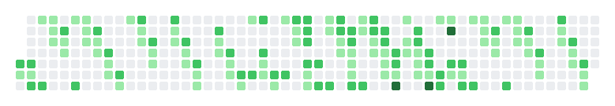
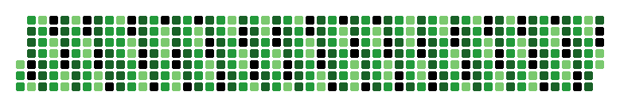
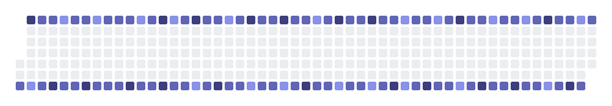
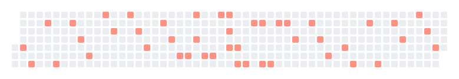
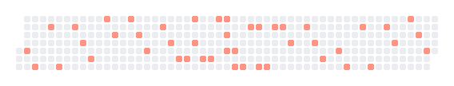
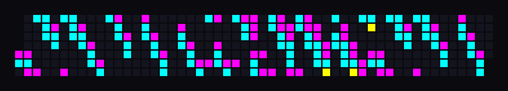

# contribution-grid

[](https://crates.io/crates/contribution-grid)
[](https://docs.rs/contribution-grid)
[](LICENSE)

A Rust crate for generating customizable, GitHub-style contribution heatmap graphs as images.

This crate provides a builder interface to create contribution heatmaps, similar to those found on GitHub user profiles. It supports custom date ranges, colors, and dimensions, outputting the result as an image.

## Usage

Add this to your project:

```bash
cargo add contribution-grid
```

## Example

```rust
use contribution_grid::{ContributionGraph, Theme, LinearStrategy};
use chrono::NaiveDate;
use std::collections::HashMap;

fn main() -> Result<(), Box<dyn std::error::Error>> {
    let mut data = HashMap::new();
    data.insert(NaiveDate::from_ymd_opt(2023, 1, 1).unwrap(), 5);
    data.insert(NaiveDate::from_ymd_opt(2023, 1, 2).unwrap(), 12);

    // Use a built-in theme with a linear mapping strategy
    let img = ContributionGraph::new()
        .with_data(data)
        .theme(Theme::blue(LinearStrategy))
        .generate();

    img.save("graph.png")?;
    Ok(())
}
```

## Mapping Strategies

The library supports different ways to map contribution counts to colors:

- **`LinearStrategy`**: Maps counts linearly based on the maximum count in the dataset.
- **`LogarithmicStrategy`**: Emphasizes differences at lower values.
- **`ThresholdStrategy`**: Uses fixed user-defined thresholds.

```rust
use contribution_grid::{Theme, ThresholdStrategy};

// Use fixed thresholds: 0, 1-4, 5-9, 10-19, 20+
let palette = Theme::github(ThresholdStrategy::new(vec![1, 5, 10, 20]));
```

## Themes

The library comes with several built-in themes:

### GitHub (Default)


### GitHub Old


### Blue


### Red


### Custom Examples

**Custom Dimensions (Small Boxes):**


You can also customize dimensions and colors via the `Palette` struct.

**Custom Neon Theme:**


## License

This project is licensed under the [MIT License](LICENSE).
